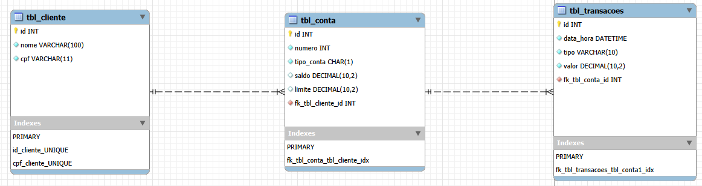

    [](https://www.linkedin.com/in/raphael-cortes-b0b544305/) [](https://www.instagram.com/raphaelcorte_s/) [](https://wa.me/5561998294492)
# Sistema Bancário em Python

Sistema bancário digital baseado no terminal, integrando os conceitos de **Programação Orientada a Objetos (POO)** à persistência de dados relacional com **SQLite**. O sistema gerencia o fluxo completo de cadastro de clientes, abertura de contas (Corrente/Poupança), movimentações financeiras em tempo real e emissão de extratos consolidados.

## 📌 Sobre o Projeto
Este projeto foi desenvolvido com o objetivo de consolidar os pilares de POO e arquitetura modular, evoluindo de uma aplicação puramente em memória RAM para um sistema com persistência robusta em banco de dados local. Para otimizar o hardware, o sistema utiliza a estratégia de **Lazy Loading (Carga Tardia)** com cache em memória para a exibição de extratos, evitando consultas redundantes ao banco de dados após a primeira leitura.

  

## 🗂️ Estrutura do Projeto

  

```bash
.
│   main.py
│   readme.md
│
├───database
│   │   criar_db.py
│   │   __init__.py
│   │
│   └───modelagem
│           conceitual_sistemabancario.brM3
│           conceitual_sistemabancario.PNG
│           logico_sistemabancario.PNG
│           modelo_logico_sistemabancario.mwb
│           modelo_logico_sistemabancario.mwb.bak
│
├───entidades
│       cliente.py
│       conta.py
│       __init__.py
│
├───operacoes
│       banco.py
│       __init__.py
│
└───utilitarios
        exceptions.py
        __init__.py
```

  

## 🧱 Organização Modular

  

O projeto separa estritamente as responsabilidades em pacotes isolados:

  

### 📦 entidades

Define as regras estruturais dos componentes do sistema:

- `cliente.py`: Representa o usuário do banco, encapsulando dados cadastrais e o mapeamento de ID relacional.

- `conta.py`: Classe abstrata (molde) que estipula o comportamento base de depósitos, sincronização de saldos e a mecânica de extrato sob demanda. É herdada por ContaCorrente (com limite de cheque especial) e ContaPoupanca.

### 📦 operacoes

`banco.py`: Centraliza o controle de fluxo, reidratação de objetos vindos do banco de dados, busca de correntistas por CPF e aplicação das regras de negócio de criação de contas.
  

### 📦 utilitarios

Contém utilitários auxiliares:

- Tratamento de exceções personalizadas

>A modularização garante maior organização, legibilidade e escalabilidade do sistema, indo de acordo com as melhores práticas de programação.

## Modelagem do Banco de Dados
A arquitetura do banco de dados foi previamente planejada para refletir fielmente o modelo de classes do sistema, garantindo a integridade referencial por meio de chaves estrangeiras. O ecossistema é baseado em três entidades principais:

- Cliente: Possui cardinalidade (1,N) com as contas, permitindo que um cliente gerencie múltiplos subtipos de conta.

- Conta: Centraliza as informações financeiras. Possui uma relação de dependência e herança lógica expressada no banco pelo campo tipo_conta (CORRENTE/POUPANCA).

- Transação: Entidade fraca vinculada diretamente a uma conta específica (1,N), registrando o histórico cronológico de depósitos e saques.


  

## 🧱 Funcionamento Interno e Conceitos Aplicados

### Encapsulamento
Atributos críticos como `_saldo`, `_numero` e `_historico` foram protegidos com visibilidade restrita (prefixo `_`), impedindo alterações externas diretas. O acesso seguro é exposto estritamente via propriedades (`@property`).

### Abstração
A classe `Conta(ABC)` atua como um contrato abstrato. Ela impede a instância direta de uma "Conta genérica", exigindo que o sistema manipule apenas especificidades reais do negócio (`ContaCorrente` ou `ContaPoupanca`).

### Herança e Polimorfismo
`ContaCorrente` e `ContaPoupanca` herdam a estrutura compartilhada da classe pai. O polimorfismo se aplica no método abstrato `sacar(valor)`: a conta corrente computa o saldo somado ao limite do cheque especial, enquanto a poupança executa uma validação estrita sobre o saldo real disponível.

### Mecânica de Lazy Cache (Otimização de Consultas)
Ao acessar uma conta, o histórico de transações não é carregado imediatamente da tabela `tbl_transacoes`. 
1. Na **primeira requisição de extrato**, o sistema busca os dados históricos no banco, popula a memória RAM (`self._historico`) e altera um sinalizador interno (`self._historico_carregado = True`).
2. Nas **consultas subsequentes** ou novas transações da mesma sessão, o bloco de conexão com o banco de dados é completamente ignorado, renderizando o extrato diretamente da memória RAM instantaneamente.

## 🛠️ Stack
- **Python 3.12+** - Linguagem de programação principal.
- **SQLite3** - Banco de dados relacional embutido.
- **brModelo / MySQL Workbench** - Ferramentas de modelagem de dados.

## ▶️ Como Executar

Clone o repositório:

```bash
git clone https://github.com/raphaelcortesdev/SistemaBancario_POO.git
```
No terminal, navegue até o repositório clonado e execute o sistema:

```bash
python main.py
```
## 📚 Aprendizados Consolidados

- **Modularização estruturada**: Pacotes Python `__init__.py`.
- **Pilares de POO**: Abstração, Encapsulamento, Herança e Polimorfismo.
- **Modelagem de Banco de Dados**: Abstração do mundo real em entidades e relacionamentos.
- **Mapeamento Objeto-Relacional manual**: Data Access / Persistence com SQLite3.
- **Gerenciamento de estado híbrido**: Memória RAM vs. Disco Rígido.

---

## 📝 TODO List

- [x] Persistência de dados em banco de dados: cadastro de clientes, criação de conta e vinculação, histórico de transações e extrato consolidado.
- [x] Otimização e cache de queries locais (Lazy Loading).
- [ ] API REST (FastAPI / Flask).
- [ ] Sistema de Autenticação e Segurança (JWT / Hash de Senhas).
- [ ] Implementação de Testes Automatizados (PyTest).